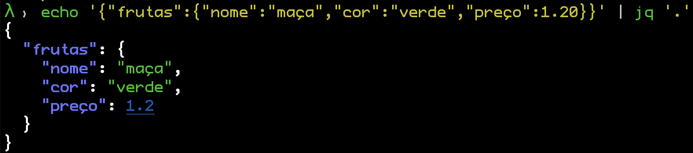
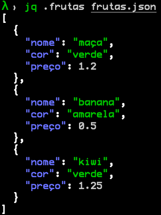

# JQ
## Pra que serve?

`jq` te auxilia a fazer queries em jsons. Como hoje em dia a maioria dos APIs se comunicam via JSON e o bash não consegue interpretar JSON,
jq pode ser o seu melhor amigo!

Digamos que você queira investigar o json:
```json
{"frutas":{"nome":"maça","cor":"verde","preço":1,20}}
```

Se eu quisesse saber o nome dessa fruta, como eu poderia fazer isso em bash?
``` bash
echo '{"frutas":{"nome":"maça","cor":"verde","preço":1,20}}'
  | egrep -o '"nome":.*?[^\\]"' 
  | cut -d: -f2
```

Legal, mas isso não parece muito flexível... Como seria isso em jq?

`echo '{"frutas":{"nome":"maça","cor":"verde","preço":1.20}}' | jq '.frutas.nome'`

Bem melhor não?

## Primeiros passos

Agora que tivemos uma palinha do jq, vamos tentar entender como ele funciona.
O jq utiliza o operador '.' (ponto) para ir navegando dentro do json. Deixa eu te mostrar via um exemplo

Para mostrar o json original você só usa o '.'

`echo '{"frutas":{"nome":"maça","cor":"verde","preço":1.20}}' | jq '.'`


 
O jq te ajuda até a visualizar melhor o json que você está trabalhando!

Agora vamos tentar pegar uma informação útil desse json, digamos que eu queria saber o nome da fruta desse json, como funcionaria isso?


`echo '{"frutas":{"nome":"maça","cor":"verde","preço":1.20}}' | jq '.frutas.nome'`

Podemos entender desse exemplo então quando usamos o operador '.' podemos adentrar o json e acessar outros valores do json.

Algo legal de falar aqui é que caso a chave do seu json tenha algum caracter especial você precisa colocar entre aspas duplas, exemplo:

`echo '{"frutas":{"nome":"maça","cor":"verde","preço":1.20}}' | jq '.frutas."preço"'`

É bom saber disso quando sua chave tem `-` ou espaço!

E caso eu queira retornar o nome da fruta e seu preço? Para isso colocar `,` entre os operadores!

`echo '{"frutas":{"nome":"maça","cor":"verde","preço":1.20}}' | jq '.frutas.nome,.frutas."preço"'`

Pra finalizar, ao invés de ficar usando echo, podemos falar para o jq usar um arquivo ao invés de ficar usando só o stdin

`jq . fruta.json`

## Listas

Não é só de objetos que o json é formado, vamos ver agora como lidamos com elemento de lista dentro do nosso json!

`jq .frutas frutas.json`

Podemos ver que o elemento `frutas` é uma lista com vários objetos `fruta`



Caso queiramos apenas esses objetos fora da lista, podemos fazer o seguinte:

`jq .frutas[] frutas.json`

Se você quiser apenas a primeira fruta dessa lista, podemos fazer o seguinte:

`jq .frutas[0] frutas.json`

Agora, se eu quiser o nome de todas as frutas dessa lista, o que devo fazer? Existe algum tipo de laço dentro do JQ? 

Não precisa! O JQ permite a gente acessar chaves dentro dessa lista de uma outra maneira

`jq .frutas[].nome frutas.json`

O jq permite a gente utilizar o mesmo conceito de `pipes` do linux e isso pode deixar nossas queries mais organizadas.

`jq '.frutas[] | .nome' frutas.json`
Só não pode esquecer das aspas simples!

Esse pipe funciona como um ponto de parada, você pode colocar vários tipos de pipes e ir tratando o seu json com calma

## Funções 

Jq tem uma extensa biblioteca de funções disponíveis para a gente usar!

Um exemplo simples é a função `keys`

`jq '.frutas[] | keys' frutas.json`

Para ver mais funções acesse o [link](https://stedolan.github.io/jq/manual/#Builtinoperatorsandfunctions)

## Selecionando valores

Posso pegar o valor de um json dependendo de um valor?

Podemos! Para isso precisamos usar a função select

`jq '.frutas[] | select(.nome=="maça")' frutas.json`

Podemos até usar operadores lógicos

`jq '.frutas[] | select(.nome=="maça" and ."preço" < 1.0)' frutas.json`

## Formatando o seu json

E agora vem uma funcionalidade muito legal do jq, podemos usar ele para formatar o nosso json em um outro json! Ou seja, caso o json que começamos a trabalhar esteja muito poluído com varios campos e dificil de tratar nós podemos usar o jq para criar um outro json 

Pra isso vamos ver um outro json, o json que o github nos dá sobre o projeto do jq:

`curl 'https://api.github.com/repos/stedolan/jq/commits?per_page=5' | jq '.'`

Muito grande esse json, não? Como poderia formatar esse json para algo mais simples?

`curl 'https://api.github.com/repos/stedolan/jq/commits?per_page=5' | jq '.[] | {name: .commit.committer.name, message: .commit.message}'`

Podemos ver que estamos usando operador pipe `|` para formatar o nosso novo json!

Só para melhorar um pouco melhor o nosso novo json, vamos colocar todo esse novo json dentro de uma lista!

`curl 'https://api.github.com/repos/stedolan/jq/commits?per_page=5' | jq '[.[] | {name: .commit.committer.name, message: .commit.message}]'`

